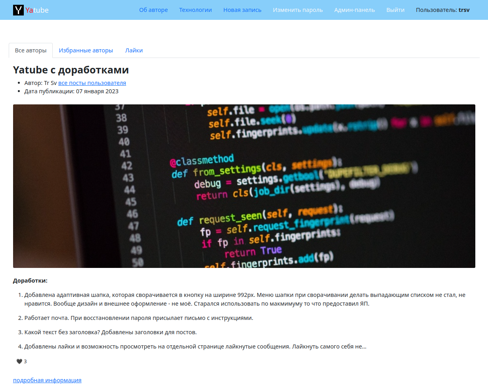

[](https://www.python.org/)
[](https://www.djangoproject.com/)


 # Yatube Plus. Социальная сеть блогеров
 Форк учебного проекта Яндекс.Практикум

## Описание
Социальная сеть для публикации личных дневников.

Это сайт, на котором можно создать свою страницу. Если на нее зайти, то можно посмотреть все записи автора.
Пользователи смогут заходить на чужие страницы, подписываться на авторов и комментировать их записи.
Автор может выбрать имя и уникальный адрес для своей страницы.
Администратор имеет возможность модерировать записи и блокировать пользователей. Записи можно отправить в группу и посмотреть в ней записи разных авторов.

**Доработки:**

- Добавлена адаптивная шапка, которая сворачивается в кнопку на ширине 992px. Меню шапки при сворачивании делать выпадающим списком не стал, не нравится. Вообще дизайн и внешнее оформление - не моё. Старался использовать по макмимуму то что предоставил ЯП.

- Работает почта. При восстановлении пароля присылает письмо с инструкциями.

- Какой текст без заголовка? Добавлены заголовки для постов.

- Добавлены лайки и возможность просмотреть на отдельной странице лайкнутые сообщения. Лайкнуть самого себя нельзя.

- Добавлен фильтр нецензурных слов, работающий на алгоритме расстояний Левенштейна. В админке создана возможность добавлять "плохие слова" в этот фильтр. Работает на формах создания поста (заголовок, текст поста) и комментариях. Для тестирования в базу [демо-сайта](https://trsv-dev.ru) добавлено несколько псевдо-плохих слов: апельсин, арбуз, манго, груша, яблоко, малина, киви. Алгоритм работает так, что даже если написать "аr6уz" или "молиnа" он все равно задетектит нужные слова, сообщит вам об этом и не даст создать пост или комментарий с этим словом. Обойти эту проверку можно навстявляв лишних символов в слово, например, м__о__л__и__n__а. Тогда прокатит. Работаю над тем чтобы не прокатило :)

- Появилась возможность удалять свои записи и комментарии.

- Возможность писать посты и комменты с использованием базового markdown-форматирования из админки и со страниц.

Мелкие изменения и допилы, которые уже забыл.


**В планах:**

Нормальный ресайз картинок, подписи к картинкам, markdown-редактор WYSIWYG хотя бы в админке, профили пользователей с аватарами, возможно лайки комментариев и их редактирование.
### Технологии
Python 3.9

Django 2.2.19
### Запуск проекта в dev-режиме
- Установите виртуальное окружение:
```
python3.9 -m venv venv
```
- Активируйте виртуальное окружение:
```
source venv/bin/activate
```
- Перейдите в папку проекта:
```
cd /yatube_plus
```
- Выполните миграции:
```
python3 manage.py migrate
```
- Установите зависимости из файла requirements.txt:
```
pip install -r requirements.txt
``` 
- Создайте суперпользователя:
```
python3 manage.py createsuperuser
```
- В корне проекта найдите файл **.env.example**, переименуйте в **.env** и заполните своими данными.
- Если в _.env_ параметр **Debug** ставите в **False**, то обязательно выполнить: 
```
python3 manage.py collectstatic
```
иначе не будут найдены стили страниц и изображения.
- В корне проекта найдите файл **.env.example**, переименуйте в **.env** и заполните своими данными.
- В папке с файлом manage.py выполните команду:
```
python3 manage.py runserver
```

### Автор:
[trsv-dev](https://github.com/trsv-dev)